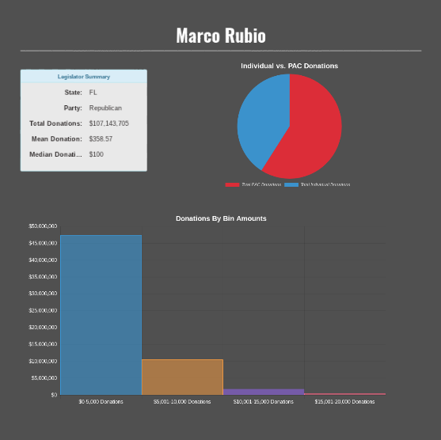

# Quantifying Corruption Final Report
**Team number:** 9  

**Team members:**
- Andrey Karnauch  
- William Lifferth  
- Kelsey Veca  
- Chris Dean  

## Introduction
The United States spent 3.15 billion dollars on lobbying in 2016. The trend of lobbying in the United States
has only risen over the years. Lobbying is intended to give the stakeholders of certain policies a direct method
of communicating with their representatives. The failing of this system is that it gives disproportionate amount
of influence to those with more financial resources. This creates an undesirable scenario where those with more
economic resources will pursue goals that reinforce their control over those resources, without regard for the
well-being of others. Previously this issue has been explored statistically, but in order to truly be made operational it must be presented in an format that is both accessible and easily understood.

We created a [free web app](http://quantifying-corruption.herokuapp.com/) to allow the average citizen to monitor their representative's campaign contributions. Our application condenses data from [Open Secrets](http://www.opensecrets.org) into a user frendly format with visualizations.

### Project Results
As a team we consider the final project a success. We successfully created a product which can help the public stay informed on political contributions to specific candidtates. While we did not implement some specific features and some specific data, such as NRA donations, was never visualized we did in the end create a successful project which exceeded the minimum expectation.

## Customer Value
### Customer Need
Our customer consists of a group of students currently participating in an independent study. Their study dives deep into how lobbyist/donator party affiliation affects the political party affiliation of the representatives on the receiving end. This project requires lots of data analysis to track every donation made to every representative and has the potential to shed light on some representatives who are more "corrupt" than others based on how much donors' party affiliation sways theirs.

The customer wants our team to take these findings and present them in a web app that is accessible to anyone curious about certain government representatives and their level of "corruption" based on the criteria above. With our help, the customer's base project gains a new level of meaning by not only identifying potential patterns of corruption, but also informing the citizens of America about these findings (by making the database searchable).

Because this project has the potential to reveal a lot about politicians in a time when politics are an extremely hot topic, we could expect to receive some recognition in the context of the market, whether it is user traffic, offers from interested third parties, or more. However, this relies both on the customer's final product in conjunction with ours, and the exposure of our web app once finished.

### Changes in Customer Value/Requirements/Measures of Success:
1. No data being received on Bills
   - **Date**: Sprint 3
   - **Motivation**: Time constraints
   - **Desc**: We were orginally going to be receiving donation data both on legislators and bills, however, we are now only receiving data on legislators, which is still fine and narrows our scope.
2. "Provide a search bar that queries the customer's database"
   - No changes, still a main requirement that is on track
3. "Display results of searches in an elegant and meaningful manner"
   - **Date**: Sprint 4
   - **Motivation**: Desire to meet the "elegant and meaningful" Requirements
   - **Desc**: This Measure of Success was built on during Sprint 4 when we decided to use chart.js for visualization. We believe this will help us both meet the original requirement and also extend it to something more meaningful.
4. "Deliver a modern looking set of pages and styling to attract users"
   - **Date**: Sprint 3
   - **Motivation**: Thematic elements to go along with "political corruption"
   - **Desc**: Rather than just going for a purely modern look, we decided to adjust this requirement a bit to also account for thematic elements. We ended up with a combination between modern and symbolic for our splash page.
5. "Create data visualizations and charts using D3"
   - **Date**: Sprint 4
   - **Motivation**: D3 was overkill for what we were looking for towards the end of our project
   - **Desc**: Rather than learning/using D3, we ended up going with a much more direct charting framework, Chartjs, to deliver a results page that we were lagging behind on.
## Technology

**Architecture**:

The core framework we're using for this project is Django which is written in Python. Django by default uses a SQLite database to store default django records (mostly users) and our custom models. We utilize the Jinja templating engine to put custom data into our html web pages, and a bootstrap frontend with vanilla javascript. The Data Visualizations/charts were done using Chatjs. We are hosting our project on a Heroku backend that supplies us with a platform without needing to configure or maintain our own virtual server; the Heroku backend uses a PostgreSQL database.

**What Works**:
  1. Successful deployment on Heroku: View [here](http://quantifying-corruption.herokuapp.com/)
  2. Splash/search page:

  
  3. Search functionality:

  
  4. Data Visualizations: 
  
  

**Successful Tests Run**:
  - Accessing the web-app from several devices.
    - Desktop runnning OS X
    - Desktop runnning Windows
    - Desktop runnning Unbuntu
    - Chromebook
    - Android
    - iPhone
  - Accessing the web-app from several browsers.
    - Chrome
    - Safari
    - Firefox
    - Edge
  - Navigation bar redirection
    - On all above Systems
  - Search button functionality
    - On all above Systems
  - Returned search data vs. data in the database
    - On all above Systems

## Team
Team member roles since the start of this project:
  1. William Lifferth
     - Project lead, main contributor and project designer
  2. Andrey Karnauch
     - Data Visualization/Results page and organizing issues/sprints
  3. Chris Dean
     - Initial Heroku integrator and model designer
  4. Kelsey Veca
     - UX Engineer

As the project progressed it became clear that William and Andrey were taking on key leadership roles and Chris and Kelsey took on supporting roles.

## Project Management
Unfortunately, we were unable to meet all of our goals for this project; however, we were successful in achieving the vast majority of our goals. We were a little ambitious on many aspects and let some stretch goals creep into the scope of our project. We were unable to get the full extent of data that we had hoped and thus did not make visualizations for all of the data that we had originally planned such as which PACs were making donations, a better scope of individual donation amounts, election outcomes, bill/law statistics, and a full filterable ranking of top donation receivers. We also struggled at times with communications amongst ourselves and with our collaborating group as well as with consistently finding ways to divvy up and delegate meaningful tasks to all group members. We learned a lot and accomplished a lot, and while we were not perfect, we are proud of what we accomplished this semester.

## Reflection
- What went well?
  - For the most part, we organized our Github issues and milestones pretty well. In terms of our product, we came together on a symbolic yet modern looking theme for the website. In the end we created a functional website that met all of the critical goals which the project came to have.
- What did not go well?
  - One of our weakest points since the start has been poor communication with our customer. Also, we did not all carry our weight equally for the entire project, which was addressed by assigning new, meaningful issues/tasks for everyone.
- Final Project:
  - We very much feel the final project was a success. We successfully created a product which was more than just a miniumum viable solution. While we did not implement all the features, such as integration with docker, and some specific data, such as NRA donations, we did in the end create a project which can help the public stay informed on political contributions to specific candidtates.
